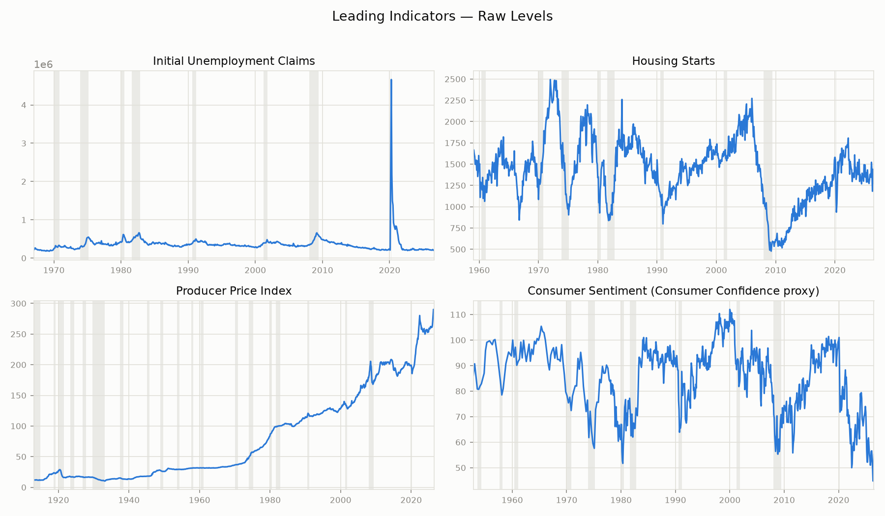
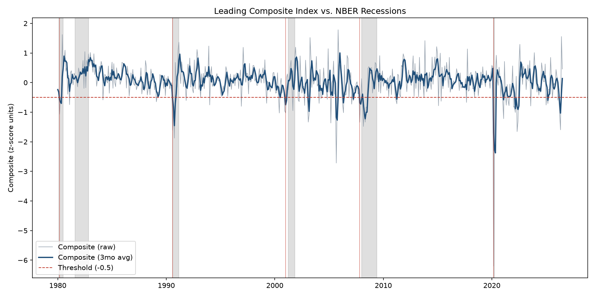

# Economic Indicators

A small research pipeline built around the indicator list in *Investing 101* (Michele Cagan): GDP, CPI, Consumer Confidence, Job Growth, Initial Unemployment Claims, Housing Starts, the Leading Economic Index, Business Inventories, and PPI. Rather than just tracking them on a dashboard, this project builds a **composite leading index from the genuinely leading indicators, and backtests it against actual NBER recessions** with a documented, non-black-box methodology and an honest report of where it worked and where it didn't.

Companion project: [pce-compare](https://github.com/by-tayo/pce-compare) (personal spending vs. national PCE benchmarks).

## Why not just use all 9 indicators as "leading"?

The book's list mixes indicators that sit in different places in the business cycle. Feeding lagging indicators like CPI or GDP into a *leading* index would blunt its lead time by the time GDP confirms a slowdown, it's already happened. So each indicator is classified, and only the leading ones feed the composite. The rest are tracked for context.

| Indicator | FRED series | Class | In composite? | What it measures |
|---|---|---|---|---|
| Initial Unemployment Claims (UI) | [`ICSA`](https://fred.stlouisfed.org/series/ICSA) | Leading | ✅ (inverted) | New jobless benefit claims each week, one of the fastest-moving signals of labor market stress. |
| Housing Starts | [`HOUST`](https://fred.stlouisfed.org/series/HOUST) | Leading | ✅ | New residential construction starts, sensitive to interest rates and confidence, moves before broader activity. |
| Producer Price Index (PPI) | [`PPIACO`](https://fred.stlouisfed.org/series/PPIACO) | Leading | ✅ | Prices producers receive for output feeds into future consumer prices (CPI). |
| Consumer Confidence (CC) | [`UMCSENT`](https://fred.stlouisfed.org/series/UMCSENT) | Leading | ✅ | University of Michigan Consumer Sentiment. The Conference Board's own Consumer Confidence Index isn't freely available on FRED, so this widely-used free equivalent stands in for it. |
| Job Growth | [`PAYEMS`](https://fred.stlouisfed.org/series/PAYEMS) | Coincident | Dashboard only | Total nonfarm payroll employment confirms the cycle roughly in real time rather than ahead of it. |
| GDP | [`GDPC1`](https://fred.stlouisfed.org/series/GDPC1) | Coincident/Lagging | Dashboard only | Real GDP - the broadest measure of output, but reported quarterly and revised after the fact. |
| CPI | [`CPIAUCSL`](https://fred.stlouisfed.org/series/CPIAUCSL) | Lagging | Dashboard only | Consumer Price Index - headline inflation, the main driver of Fed rate decisions per the book's thesis, but a lagging confirmation of price pressure that already happened. |
| Business Inventories | [`BUSINV`](https://fred.stlouisfed.org/series/BUSINV) | Lagging | Dashboard only | Total business inventories — tends to build up *after* demand has already turned. |

Two benchmark series are also pulled, but never used as composite inputs:

- **`USREC`** — the NBER recession indicator (the ground truth the composite is scored against).
- **`USSLIND`** — the Philadelphia Fed's own "Leading Index for the United States." This is the Conference Board's official LEI's free cousin; it's included only as a secondary reference series, never as an input, since using someone else's leading index to build your own would be circular. (Note: this particular FRED series stops updating in early 2020 in the cached pull — treat it as historical context, not a live benchmark.)

## Current snapshot

Latest value per indicator vs. 12 months prior (`python 06_snapshot.py`, as of the last `01_fetch_data.py` run):

| Indicator | Class | Latest | as of | 12mo ago | Trend |
|---|---|---|---|---|---|
| Initial Unemployment Claims | leading | 201,000 | 2026-09-01 | 234,000 | Falling |
| Housing Starts | leading | 1,275 | 2026-08-01 | 1,291 | Falling |
| Producer Price Index | leading | 287.93 | 2026-08-01 | 262.11 | Rising |
| Consumer Sentiment (Consumer Confidence proxy) | leading | 55.2 | 2026-07-01 | 61.7 | Falling |
| Nonfarm Payrolls (Job Growth) | coincident | 159,075 | 2026-08-01 | 158,472 | Flat |
| Real GDP | coincident/lagging | 24,269.61 | 2026-04-01 | 23,770.98 | Rising |
| CPI | lagging | 334.13 | 2026-08-01 | 323.29 | Rising |
| Business Inventories | lagging | 2,764,708 | 2026-07-01 | 2,663,019 | Rising |

Note "Falling" for Initial Claims is *good* news (fewer people filing for unemployment) direction alone doesn't say good or bad the same way across every row, which is exactly why the indicator table above spells out what each series measures.



## Methodology

1. **Fetch** all series from FRED, caching raw pulls to `data/raw/` so reruns don't hit the API.
2. **Align to monthly**: weekly claims are averaged per month; quarterly GDP is forward-filled; the rest are already monthly.
3. **Normalize**: each of the 4 leading series is z-scored over its own full history. Initial Claims is inverted (rising claims is bad news, so its z-score is flipped) before combining.
4. **Weight**: equal weight (25% each) across the 4 leading series — fixed before ever looking at backtest results, on purpose. Tuning weights against the same data used to score performance would make the backtest meaningless.
5. **Combine**: weighted sum of z-scores, plus a 3-month moving average (the raw composite is noisy month to month).
6. **Signal rule**: the composite crossing below **-0.5** (fixed a priori, never fit to the data) counts as a recession warning.

All of this lives in [`econ_common.py`](econ_common.py), covered by unit tests on synthetic data (`tests/test_econ_common.py`) — no network access required to verify the math.

## Backtest results

Run against every U.S. recession from 1970 to 2020 (`python 03_backtest.py`):

| Recession start | Signal date | Lead (months) | Caught? |
|---|---|---|---|
| 1970-02 | — | — | ❌ |
| 1974-02 | — | — | ❌ |
| 1980-02 | 1979-12 | 2 | ✅ |
| 1981-08 | 1981-02 | 6 | ✅ |
| 1990-08 | — | — | ❌ |
| 2001-04 | — | — | ❌ |
| 2008-01 | — | — | ❌ |
| 2020-03 | — | — | ❌ |

**2/8 recessions caught**, average lead time when it did catch one: **4 months**. One false positive (a threshold crossing in **1991-11** with no recession following within 12 months).



### Honest evaluation

This composite is a **weak leading indicator by this backtest, not a reliable one.** It caught the early-1980s recessions (both preceded by the Fed's aggressive rate hikes, which visibly hit housing starts and sentiment ahead of time) but missed 1970, 1974, 1990, 2001, 2008, and 2020. Looking at the chart (`output/index_vs_recessions.png`), the composite often *does* dip around recessions — 1990, 2001, and 2008 all show visible drops — but the drop frequently arrives at or after the recession's official start rather than clearly ahead of it, so it doesn't register as a "hit" under this backtest's lead-time rule. A softer threshold or a shorter frequency (this analysis uses monthly resampling) would likely catch more of these at the cost of more false positives — that tradeoff is the whole reason the threshold is fixed and documented rather than tuned per-recession.

**2020 hold-out**: the threshold and weights were fixed using the general methodology above, without ever tuning against 2020 data. The composite **missed** the COVID recession — which makes sense in hindsight: this was a sudden external demand shock, not the kind of gradually-building imbalance (credit tightening, housing overbuilding, inventory glut) that indicators like claims, housing starts, and sentiment are built to catch ahead of time. A miss here is a legitimate finding about what this kind of index can and can't see, not a bug to paper over.

### Limitations

- Only 4 components, equally weighted — the official Conference Board LEI uses ~10 components with non-equal, empirically-derived weights (which this project deliberately avoids to keep the method transparent, at the cost of some accuracy).
- `UMCSENT` was collected quarterly (not monthly) before 1978, so the composite has some sparse coverage in 1967-1977.
- A -0.5 z-score threshold is one reasonable choice, not the only one; the backtest results would shift with a different threshold.
- 8 recessions is a small sample — one or two additional hits/misses would meaningfully change the hit rate.

## Setup

```powershell
pip install -r requirements.txt
copy .env.example .env
# edit .env and add your FRED API key (free, instant activation:
# https://fred.stlouisfed.org/docs/api/api_key.html)
```

## Usage

```powershell
python 00_check_setup.py     # verify API key + connectivity
python 01_fetch_data.py      # pull all series, cache to data/raw/
python 02_build_index.py     # build the composite + dashboard series
python 03_backtest.py        # score against NBER recessions, writes output/results.csv
python 04_plot_results.py    # writes output/index_vs_recessions.png
python 05_indicator_panel.py # writes output/indicator_panel.png
python 06_snapshot.py        # writes output/snapshot.csv + prints the markdown table above
```

Run the test suite (no API key needed — it only exercises the pure math):

```powershell
pytest tests/
```

## Project layout

```
econ_common.py       # FRED fetch + caching, index math, backtest scoring (unit-tested)
00_check_setup.py     # verify API key
01_fetch_data.py       # pull + cache raw series
02_build_index.py      # build composite + dashboard
03_backtest.py         # score vs. USREC, write results.csv
04_plot_results.py     # chart composite vs. recessions
05_indicator_panel.py  # small-multiples chart of the 4 leading indicators
06_snapshot.py          # latest-value snapshot across all 8 indicators
tests/                 # pytest suite for econ_common.py
data/raw/              # cached raw FRED pulls (gitignored)
data/processed/        # composite + dashboard series (gitignored)
output/                # results.csv, snapshot.csv, charts (committed)
```
